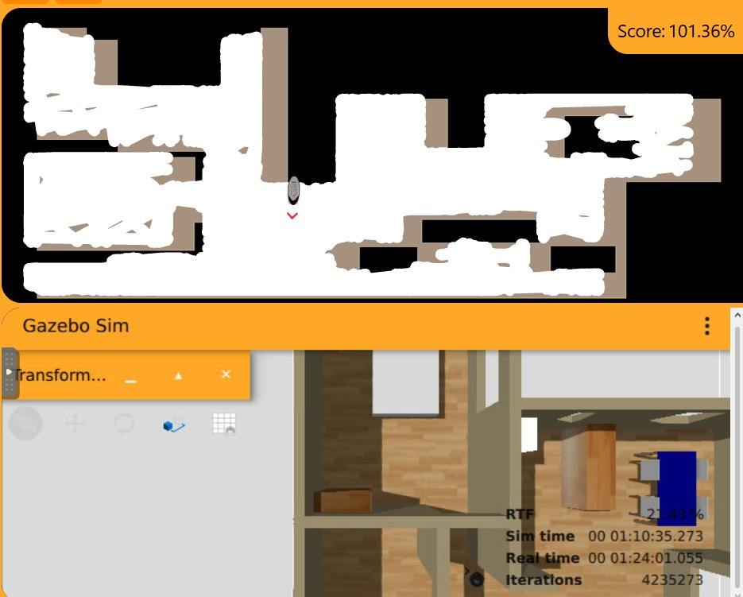
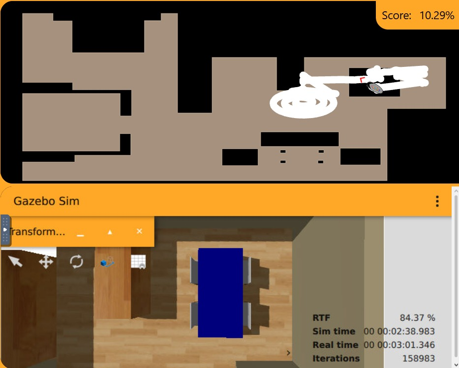

# PRACTICA 1
## Navegación de un robot aspiradora de gama baja
Lo primero que he pensado para poder realizar esta practica es mirar que _import_ son necesarios para poder usar esas librerias para que el robot funcione. Una vez visto los _import_ defino el tipo de algoritmo que me gustaria usar para realizar esta practica. En este caso se nos da como algoritmo obligatorio el algoritmo de **espiral**, el cual he usado pero aplicandole una pequeña modificación ya que no aplica el comando de espiral constantemente.\
\
Pero antes de aplicar el algortimo al codigo y probarlo, defino la tabla de estados que voy a tener en el codigo. En mi caso hago una tabla con 4 estados:\
    - **SPIRAL** (Este es un añadido ya que es el algoritmo y en el enunciado se nos dice que nuestro codigo tiene que tener al menos 3 estados, que son los siguentes que menciono)\
    - **DASH**\
    - **TURN**\
    - **BACK**\
\
En mi caso he planteado que empieze con el estado de espiral, pero despues de chocarse o encontrar un objeto simplente avanza. Pero planteo dos situaciones por tiempo:\
    - En menos de 8 segundos: Si antes de 8 segundos el robot encuentra otro objeto, el tiempo se reinicia y vuelve a aplicar el estado de volver hacia atras, girar sobre si mismo y finalmente avanzar hacia delate.\
    - Justo en 8 segundos: En caso de que el tiempo llegue a 8 segundos sin encontrar un obstaculo, procede ha iniciar de nuevo ese estado de espiral.\
\
Una vez ya tengo la estructura del código paso a crearlo, dandole forma con funciones y dando unos valores genericos (ya que todavia no hemos procedido ha hacer una prueba experimental y no sabemos que valores asignarle a cada cosa para que el funcionamiento del robot sea el más óptimo).
## Explicación de funciones
`elapsed()`
\
Esta función cuenta el tiempo que lleva el robot en ese estado, dicho de otra forma es un cronometro.\
`obstacle()`
\
Esta función hace uso de los laser del robot para la detección de objetos. La funcion devuelve TRUE o FALSE segun lo que detecten los rayos. En caso de que el rayo no detecte nada devuelve FALSE, y en caso de que el rayo detecte un objeto y ese objeto este dentro de la distancia definida devuelve TRUE.
\
`on_enter()`
\
Esta función se ejecuta una _unica vez_ cada vez que se realiza un cambio de estado. Dento de la función se realiza el cambio de estado, reinicia el cornometro para la funcion `elapsed()` y en caso de que el estado al que cambie sea **TURN** valora el tiempo de giro y la dirección de giro. Implementando asi la aleatoriedad para no repetir el mismo giro y por ende entrar en un bucle pasando por los mismo sitios.

## Ejecución
Finalmente el código ejecuta un bucle infinito, en el que ejecuta cada estado de la tabla de estados y en el que se ejecuta la función `on_enter()` para poder realizar el cambio de estados. Dentro del bucle tengo una funcion llamada `Frequency.tick()` que lo que hace es que mantenga el bucel en ejecución a 20Hz, o dicho de otra forma que se realizen 20 iteraciones por minuto.

> [!NOTE]
También podemos llegar a ver que a lo largo de la simulación y debido a mi planteamiento, el robot de vez en cuando, se queda pillado en las esquinas o debajo de la mesa. Esto he llegado a la conclusión de que se ha podido deber a que la lectura de los laser no es siempre correcta, es decir que el laser no detecta el objeto o en caso de que lo detecte lo detecta muy lejos, devolviendo FALSE y causando que hasta que no pasen los 8 segundo del "cronometro" que tengo puesto en mi codigo para realiza el cambio al estado de **SPIRAL** no reinicia el estado de los laser hasta que no gira lo suficiente hasta que el estado cambie a TRUE.
## Video
Video recotado a velocidad normal: [https://youtu.be/PzVDCNYzic8](#sample-section)
> [!NOTE]
El video esta grabado cada 5/15 minutos debido a que para completarlo al 100% en esta tanda tomaria más de dos horas. En otro par de pruebas el robot ha tardado en limpiar el 100% al rededor de 1 hora/ 1 hora y 20. Pero al ser un archivo tan grande y tan pesado he tomado la decisión de acortarlo.
Video recotado a velocidad x2: [https://youtu.be/t6TosIpqG64](#sample-section)
## Imagen Resultado de la Prueba
Durante varias pruebas cambiando tanto el codigo como los datos experimentales para la ejecución, en el caso de la imagen el código en uso es el presentado en la entrega, vemos que el robot ha logrado realizar la limpieza al 101% en aproximadamente 1 hora y 22 minutos.
\
\

> [!NOTE]
Al realizar las pruebas he podido notar que en el simulador 2D donde solo se ve el borde de las zonas no es del todo correcto ya que vemos que la mesa de arriba a la izquierda aparecene en horizontal cuando en el simulador 3D aparece en vertical. Ademas de que podemos ver que al ser una mesa el robot alguna que otra vez entra debajo para limpiar a pesar de que en el mapa 2D se identifica como objeto solido. Finalmente otra anotación a relalizar es que en el mapa 2D la zona que va apareciendo limpia sale "desplazada", con esto me refiero a que en el lado derecho del mapa queda libre como un centimetro mientras que en el lado izquiedo se sale un centimetro. Ademas que al compararlo con el 3D en este ultimo la pared no coincide con el del mapa 2D y a pesar de que en el mapa 2D se ve representado como que todavia hay huecom en el 3D vemos como se choca con la pared.

## Imagen Robot debajo de la mesa
